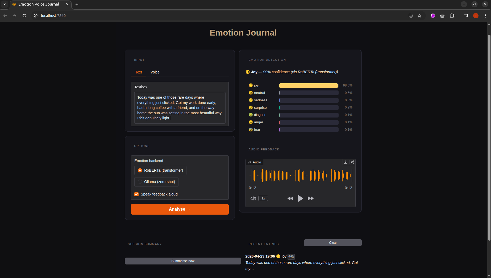
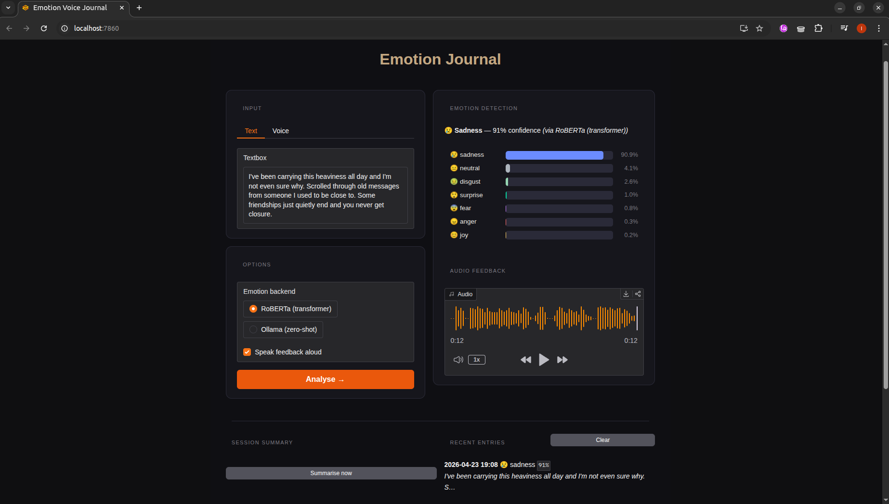
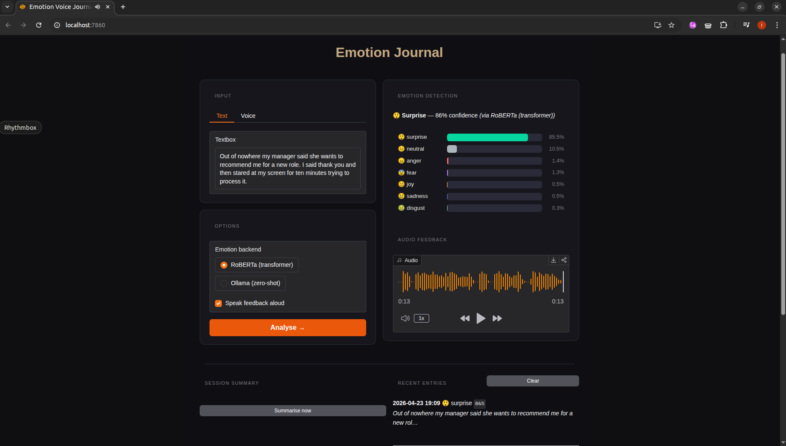
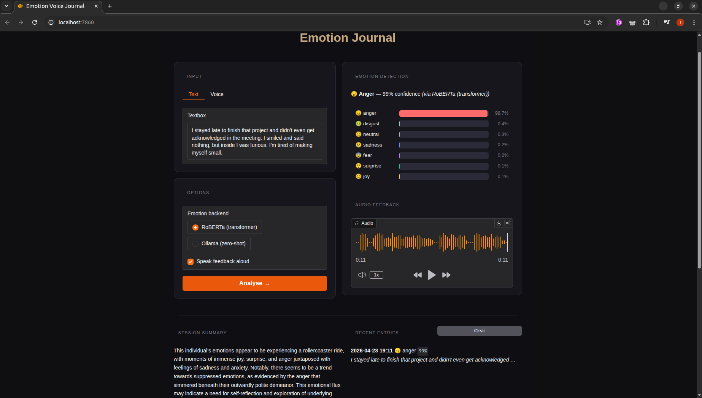

# 🎙 Emotion-Aware Voice Journal


> **Portfolio project** — end-to-end NLP/speech pipeline built as an extension of my master's thesis:  
> *"Applying Quantitative and Qualitative Methods to the Analysis of Emotions in Texts"*  

Speak or type a journal entry → emotions are detected → you hear personalised audio feedback.  
Every entry is stored and the session can be summarised in natural language via a local LLM.

---

**Joy detected from a text entry**


**Sadness detected from a text entry**


**Surprise detected from a text entry**


**Session summary generated by Ollama**


---

## Pipeline

```
🎤 Voice / ⌨️ Text
        │
        ▼
 [Whisper STT]           ← openai/whisper-base  (GPU-accelerated)
        │ transcription
        ▼
 [Emotion Classifier]    ← RoBERTa (transformer)  |  Ollama llama3.2 (zero-shot)
        │ joy · sadness · anger · fear · surprise · disgust · neutral
        ▼
 [gTTS Speaker]          ← personalised audio feedback
        │
        ▼
 📓 SQLite Journal  →  Gradio UI  +  FastAPI REST API
```

---

## Architecture

| Component | Technology | Notes |
|---|---|---|
| STT | `openai/whisper-base` | swappable model size |
| Emotion classifier | `j-hartmann/emotion-english-distilroberta-base` | swap for your own checkpoint |
| LLM zero-shot classifier | Ollama `llama3.2` (local) | optional, mirrors thesis methodology |
| TTS feedback | `gTTS` | Google Text-to-Speech |
| Demo UI | `Gradio` | dark-themed, microphone + upload |
| REST API | `FastAPI` | Swagger docs at `/docs` |
| Storage | `SQLite` | persisted via Docker volume |
| Containerisation | `Docker` + `docker-compose` | one-command GPU deploy |

---

## Prerequisites

| Requirement | Notes |
|---|---|
| Docker + nvidia-container-toolkit | for GPU-accelerated build |
| [Ollama](https://ollama.com) running locally | `ollama serve` + `ollama pull llama3.2` |
| NVIDIA GPU (recommended) | CPU fallback works, slower |

---

## Quickstart

### Docker (recommended)

```bash
git clone https://github.com/izabelaszk/emo_journal
cd emo_journal

docker compose up --build
```

- Gradio UI → http://localhost:7860  
- API docs  → http://localhost:8000/docs


### Local Python

```bash
# Install GPU PyTorch first so Whisper builds against it, then the rest.
pip install torch torchvision torchaudio --index-url https://download.pytorch.org/whl/cu121
pip install -r requirements.txt

# Gradio UI
python app.py

# FastAPI
python api.py
```

---

## API Reference

```bash
# Health check
curl http://localhost:8000/health

# Classify text
curl -X POST http://localhost:8000/classify \
     -H "Content-Type: application/json" \
     -d '{"text": "I am thrilled about this project!"}'

# Full pipeline (audio → emotions)
curl -X POST http://localhost:8000/analyse \
     -F "audio=@recording.wav"

# Retrieve journal
curl http://localhost:8000/journal
```

Example response from `/analyse`:
```json
{
  "transcription": "I am thrilled about this project!",
  "emotions": [
    {"label": "joy",      "score": 0.9241},
    {"label": "surprise", "score": 0.0423},
    {"label": "neutral",  "score": 0.0198}
  ],
  "dominant_emotion": "joy",
  "dominant_score": 0.9241,
  "feedback_text": "Great to hear! — you seem to be feeling joyful today.",
  "timestamp": "2025-06-01T14:22:10Z"
}
```

---

## Swap in your own model

```python
# app.py — change the model ID constant
EMOTION_MODEL_ID = "path/to/your-finetuned-roberta"

# or use the classifier directly
from src.emotion_classifier import EmotionClassifier
clf = EmotionClassifier(backend="transformer", model_id="./my_model_checkpoint")
```

---

## Classifier backends

```python
from src.emotion_classifier import EmotionClassifier

clf = EmotionClassifier(backend="transformer")   # fine-tuned RoBERTa (primary)
clf = EmotionClassifier(backend="ollama")         # zero-shot via local Ollama
clf = EmotionClassifier(backend="nrc")            # lexicon baseline, no GPU needed

scores = clf.predict("This is absolutely wonderful news!")
# [{"label": "joy", "score": 0.91}, ...]
```


---

## Development

```bash
# Lint (config in ruff.toml)
ruff check .

# Fast, offline unit tests — no model downloads, GPU, or network
pytest -m "not integration"

# Full suite, including model-backed integration tests
pytest
```

Tests are split into a fast offline layer (`tests/test_unit.py` — pure logic,
SQLite journal, TTS templating) and slower `@pytest.mark.integration` tests that
load the real models. The heavy imports are deferred so `-m "not integration"`
never triggers a model download during collection.

---

## Project structure

```
emo_journal/
├── app.py                      # Gradio UI
├── api.py                      # FastAPI REST API
├── src/
│   ├── emotion_classifier.py   # Unified classifier (transformer / Ollama / NRC)
│   ├── journal_store.py        # SQLite persistence layer
│   └── stt_tts.py              # Whisper STT + gTTS utilities
├── tests/
│   ├── test_unit.py            # fast, offline unit tests
│   ├── test_classifier.py      # model-backed (integration)
│   └── test_api.py             # model-backed (integration)
├── requirements.txt
├── ruff.toml                   # lint config
├── pytest.ini                  # test markers
├── Dockerfile
├── docker-compose.yml
└── LICENSE
```


